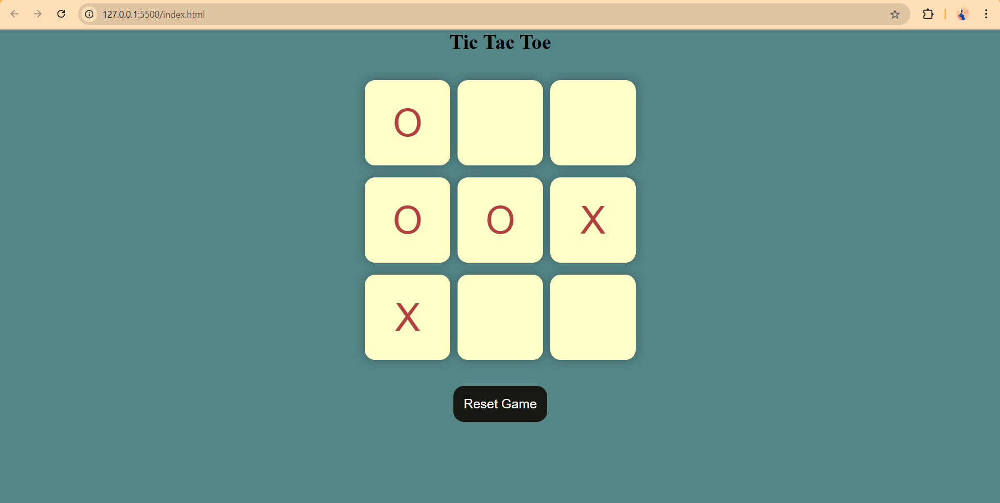
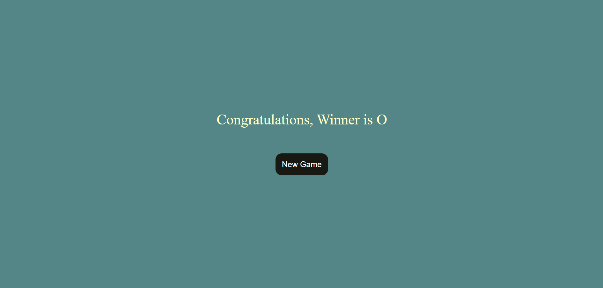
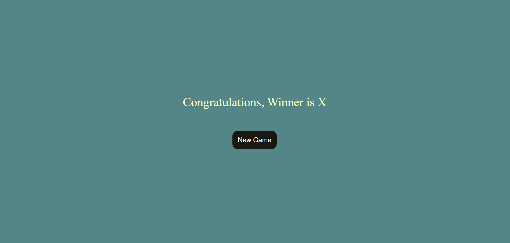

# 🎮 Tic Tac Toe Game

A simple and fun Tic Tac Toe game built with **HTML**, **CSS**, and **JavaScript**.

---

## 🚀 Features
- Two-player gameplay
- Real-time game status updates
- Highlights the winning combination
- Game reset functionality
- Fully responsive design

---

## 🛠️ Tech Stack
- HTML5
- CSS3
- JavaScript (Vanilla)

---


## 📹 Demo

Watch the recorded demo of the game in action:

[🎬 Demo Video - Click to View](./demoRec.mp4)


## 📷 Screenshots

### 🏠 Home Page
This is the initial view of the game interface before gameplay begins.



### 🎉 Winning Moment 1
Game finished with a winning combination highlighted.



### 🎉 Winning Moment 2
Another example of a win scenario in the game.



---


---

## 🧠 What I Learned
- DOM manipulation and dynamic UI updates
- Handling user interactions using event listeners
- Implementing game logic (win detection, draw handling)
- Creating responsive layouts with CSS

---

## 📂 How to Run Locally

1. Clone the repository:

```bash
git clone https://github.com/shantanulanjewar12/Tic_Tac_Toe_Project_using_HTML_CSS_and_JavaScript.git
